# SICP Study — Structure and Interpretation of Computer Programs

> Personal study repository combining the **MIT 1986 video lectures** (Abelson & Sussman)
> with the **JavaScript Edition** of SICP (Henz & Wrigstad, MIT Press 2022).

---

## Goal

Build a consistent, documented learning journey through one of the most important
CS books ever written — using modern JavaScript as the implementation language.

---

## Resources

| Resource | Link |
|---|---|
| MIT Lectures (1986) | [YouTube Playlist](https://www.youtube.com/playlist?list=PLE18841CABEA24090) |
| SICP JavaScript Edition | [Online](https://sourceacademy.org/sicpjs) |
| Source Academy (JS REPL) | [sourceacademy.org](https://sourceacademy.org) |

---

## Roadmap

```mermaid
flowchart TD
    START([SICP Study Journey]) --> CH1

    CH1["Chapter 1\nBuilding Abstractions\nwith Functions"]

    CH1 --> L1A["Lecture 1A\nOverview & Intro"]
    CH1 --> L1B["Lecture 1B\nSubstitution Model"]
    CH1 --> L2A["Lecture 2A\nHigher-Order Procedures"]

    L1A --> S11["1.1 Elements of Programming\n. Expressions\n. Naming & Environment\n. Compound Functions\n. Conditionals"]
    L1B --> S12["1.2 Functions & Processes\n. Linear Recursion vs Iteration\n. Tree Recursion\n. Orders of Growth\n. Exponentiation / GCD"]
    L2A --> S13["1.3 Higher-Order Functions\n. Functions as Arguments\n. Lambda Expressions\n. Fixed Point / Derivatives"]

    S11 & S12 & S13 --> EX1["46 Exercises\n1.1 to 1.46"]

    EX1 --> CH2["Chapter 2\nBuilding Abstractions\nwith Data"]

    CH2 --> L2B["Lecture 2B\nCompound Data"]
    CH2 --> L3A["Lecture 3A\nHenderson Escher"]
    CH2 --> L3B["Lecture 3B\nSymbolic Differentiation"]
    CH2 --> L4A["Lecture 4A\nPattern Matching"]
    CH2 --> L4B["Lecture 4B\nGeneric Operators"]

    L2B --> S21["2.1 Data Abstraction\n. Rational Numbers\n. Abstraction Barriers\n. What Is Data?"]
    L3A --> S22["2.2 Hierarchical Data\n. Sequences & Lists\n. Tree Structures\n. Conventional Interfaces\n. Picture Language"]
    L3B --> S23["2.3 Symbolic Data\n. Strings\n. Symbolic Differentiation\n. Sets / Huffman Trees"]
    L4A --> S24["2.4 Multiple Representations\n. Complex Numbers\n. Tagged Data\n. Data-Directed Programming"]
    L4B --> S25["2.5 Generic Operations\n. Generic Arithmetic\n. Combining Data Types\n. Symbolic Algebra"]

    S21 & S22 & S23 & S24 & S25 --> EX2["97 Exercises\n2.1 to 2.97"]

    EX2 --> CH3["Chapter 3\nModularity, Objects\nand State"]

    CH3 --> L5A["Lecture 5A\nAssignment & State"]
    CH3 --> L5B["Lecture 5B\nComputational Objects"]
    CH3 --> L6A["Lecture 6A\nStreams Part 1"]
    CH3 --> L6B["Lecture 6B\nStreams Part 2"]

    L5A --> S31["3.1 Assignment & Local State\n. Local Variables\n. Benefits of Assignment\n. Costs of Assignment"]
    L5B --> S32["3.2 Environment Model\n. Frames & Environments\n. Closures / Mutation"]
    L5B --> S33["3.3 Mutable Data\n. Mutable Lists\n. Queues / Tables\n. Digital Circuits\n. Constraint Propagation"]
    L5A --> S34["3.4 Concurrency\n. Time & State\n. Serializers / Mutex"]
    L6A & L6B --> S35["3.5 Streams\n. Delayed Lists\n. Infinite Streams\n. Lazy Evaluation\n. Functional vs OO"]

    S31 & S32 & S33 & S34 & S35 --> EX3["82 Exercises\n3.1 to 3.82"]

    EX3 --> CH4["Chapter 4\nMetalinguistic\nAbstraction"]

    CH4 --> L7A["Lecture 7A\nMetacircular Eval Pt.1"]
    CH4 --> L7B["Lecture 7B\nMetacircular Eval Pt.2"]
    CH4 --> L8A["Lecture 8A\nLogic Programming Pt.1"]
    CH4 --> L8B["Lecture 8B\nLogic Programming Pt.2"]

    L7A --> S41["4.1 Metacircular Evaluator\n. eval / apply loop\n. Environments\n. Running the Evaluator\n. Data as Programs"]
    L7B --> S42["4.2 Lazy Evaluation\n. Normal vs Applicative Order\n. Lazy Interpreter\n. Streams as Lazy Lists"]
    L7B --> S43["4.3 Nondeterministic\n. amb operator\n. Automatic Search\n. Backtracking"]
    L8A & L8B --> S44["4.4 Logic Programming\n. Query Language\n. Unification\n. Rules & Inference\n. Implementing Queries"]

    S41 & S42 & S43 & S44 --> EX4["79 Exercises\n4.1 to 4.79"]

    EX4 --> CH5["Chapter 5\nComputing with\nRegister Machines"]

    CH5 --> L9A["Lecture 9A\nRegister Machines"]
    CH5 --> L9B["Lecture 9B\nExplicit-Control Eval"]
    CH5 --> L10A["Lecture 10A\nCompilation"]
    CH5 --> L10B["Lecture 10B\nGarbage Collection"]

    L9A --> S51["5.1 Register Machines\n. Machine Language\n. Subroutines\n. Stack & Recursion"]
    L9A & L9B --> S52["5.2 Machine Simulator\n. Machine Model\n. Assembler\n. Performance Monitor"]
    L10B --> S53["5.3 Storage & GC\n. Memory as Vectors\n. Mark-and-Sweep\n. Stop-and-Copy"]
    L9B --> S54["5.4 Explicit-Control Eval\n. Dispatcher\n. Function Applications\n. Running the Evaluator"]
    L10A --> S55["5.5 Compilation\n. Compiler Structure\n. Code Generation\n. Lexical Addressing\n. Interpreted vs Compiled"]

    S51 & S52 & S53 & S54 & S55 --> EX5["52 Exercises\n5.1 to 5.52"]

    EX5 --> DONE(["Complete\n356 exercises / 20 lectures / 5 chapters"])

    classDef chapter fill:#4a1c8c,stroke:#7c3aed,color:#fff,font-weight:bold
    classDef lecture fill:#1e3a5f,stroke:#3b82f6,color:#fff
    classDef section fill:#1a3a2a,stroke:#22c55e,color:#d1fae5,font-size:12px
    classDef exercises fill:#7c2d12,stroke:#f97316,color:#fff,font-weight:bold
    classDef milestone fill:#1a1a2e,stroke:#a855f7,color:#e9d5ff,font-weight:bold

    class CH1,CH2,CH3,CH4,CH5 chapter
    class L1A,L1B,L2A,L2B,L3A,L3B,L4A,L4B,L5A,L5B,L6A,L6B,L7A,L7B,L8A,L8B,L9A,L9B,L10A,L10B lecture
    class S11,S12,S13,S21,S22,S23,S24,S25,S31,S32,S33,S34,S35,S41,S42,S43,S44,S51,S52,S53,S54,S55 section
    class EX1,EX2,EX3,EX4,EX5 exercises
    class START,DONE milestone
```



---

## Lecture x Book Mapping

| Lecture | Video | SICP-JS Sections | Status |
|---------|-------|------------------|--------|
| 1A | Overview and Introduction to Lisp | 1.1 — The Elements of Programming | [ ] |
| 1B | Procedures and Processes; Substitution Model | 1.2 — Functions and the Processes They Generate | [ ] |
| 2A | Higher-order Procedures | 1.3 — Higher-Order Functions | [ ] |
| 2B | Compound Data | 2.1 — Introduction to Data Abstraction | [ ] |
| 3A | Henderson Escher Example | 2.2 — Hierarchical Data & Closure Property | [ ] |
| 3B | Symbolic Differentiation; Quotation | 2.3 — Symbolic Data | [ ] |
| 4A | Pattern Matching and Rule-based Substitution | 2.3–2.4 — Symbolic Data / Multiple Representations | [ ] |
| 4B | Generic Operators | 2.4–2.5 — Multiple Repr. / Generic Operations | [ ] |
| 5A | Assignment, State, and Side-effects | 3.1 — Assignment and Local State | [ ] |
| 5B | Computational Objects | 3.2–3.3 — The Environment Model / Mutable Data | [ ] |
| 6A | Streams, Part 1 | 3.5 — Streams | [ ] |
| 6B | Streams, Part 2 | 3.5 — Streams (cont.) | [ ] |
| 7A | Metacircular Evaluator, Part 1 | 4.1 — The Metacircular Evaluator | [ ] |
| 7B | Metacircular Evaluator, Part 2 | 4.1–4.2 — Evaluator / Lazy Evaluation | [ ] |
| 8A | Logic Programming, Part 1 | 4.4 — Logic Programming | [ ] |
| 8B | Logic Programming, Part 2 | 4.4 — Logic Programming (cont.) | [ ] |
| 9A | Register Machines | 5.1 — Designing Register Machines | [ ] |
| 9B | Explicit-control Evaluator | 5.2–5.4 — Register-Machine Simulator / Explicit-Control Evaluator | [ ] |
| 10A | Compilation | 5.5 — Compilation | [ ] |
| 10B | Storage Allocation and Garbage Collection | 5.3 — Storage Allocation and Garbage Collection | [ ] |

---

## Repository Structure

```
the-wizard-book/
├── README.md
├── chapter-1/          # Building Abstractions with Functions
│   ├── README.md
│   ├── lecture-1a/
│   │   ├── notes.md
│   │   └── examples.js
│   ├── lecture-1b/
│   │   ├── notes.md
│   │   └── examples.js
│   └── exercises/
│       ├── 1.1-to-1.8.js
│       ├── 1.9-to-1.28.js
│       └── 1.29-to-1.46.js
├── chapter-2/          # Building Abstractions with Data
├── chapter-3/          # Modularity, Objects, and State
├── chapter-4/          # Metalinguistic Abstraction
└── chapter-5/          # Computing with Register Machines
```

---

## Commit Convention

```
<type>(<scope>): <description>

types  -> feat | fix | docs | refactor
scopes -> ch1 | ch2 | ch3 | ch4 | ch5
```

**Examples:**
```bash
feat(ch1): watch lecture 1A - overview and substitution model
feat(ch1): read section 1.1 - elements of programming
feat(ch1): solve exercises 1.1 to 1.8 - basic expressions
docs(ch2): add notes on data abstraction barriers
fix(ch3): correct stream implementation in exercise 3.51
```

---

## Suggested Pace (~20 weeks)

Each week covers one lecture and its corresponding book sections:

- Watch lecture   -> `feat(chX): watch lecture XY - <topic>`
- Read section    -> `feat(chX): read section X.Y - <topic>`
- Solve exercises -> `feat(chX): solve exercises X.N to X.M - <topic>`

This produces ~3–5 organic commits per week without forcing artificial activity.

---

## Setup

Any modern JS environment works. Recommended: Node.js >= 18, or use the online REPL at [sourceacademy.org](https://sourceacademy.org).

```bash
node chapter-1/exercises/1.1-to-1.8.js
```

---

## Progress

- [ ] Chapter 1 — Building Abstractions with Functions
- [ ] Chapter 2 — Building Abstractions with Data
- [ ] Chapter 3 — Modularity, Objects, and State
- [ ] Chapter 4 — Metalinguistic Abstraction
- [ ] Chapter 5 — Computing with Register Machines
